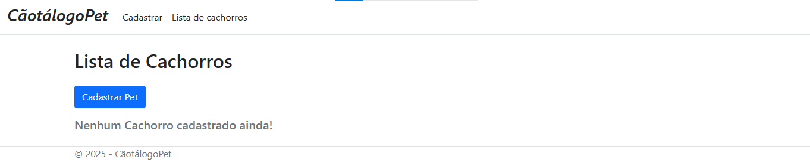
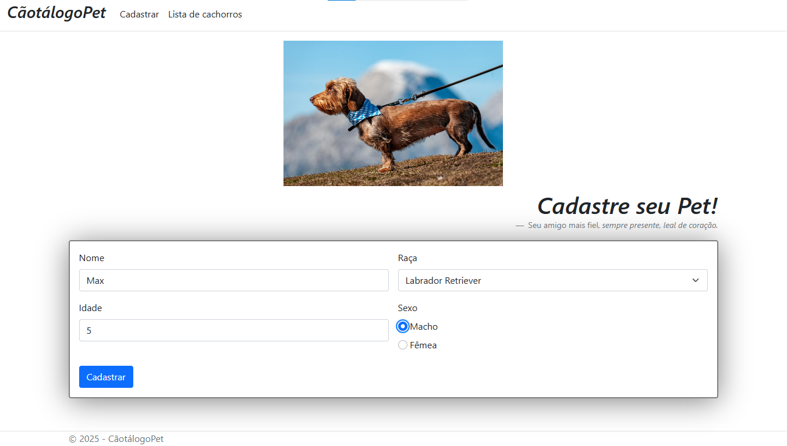
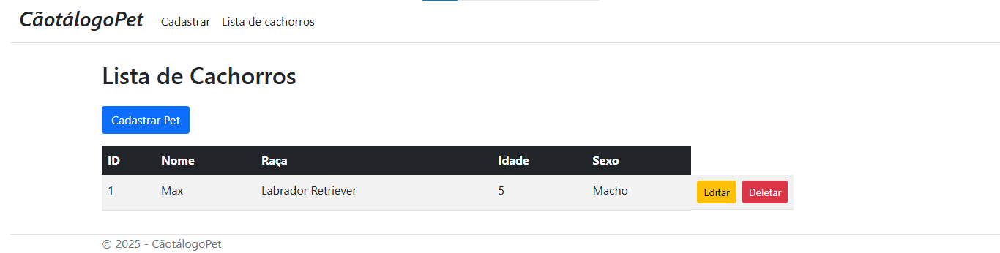
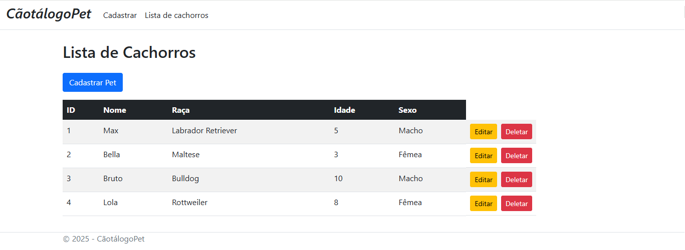

# 🐾 CãotálogoPet

**CãotálogoPet** é um sistema web completo para cadastro e gerenciamento de informações sobre cachorros.  
O projeto foi desenvolvido com foco em funcionalidade, organização e responsividade, utilizando tecnologias modernas como **ASP.NET Razor Pages**, **C#** e **JavaScript** para integração com APIs externas.

---

## 🚀 Tecnologias Utilizadas

- ✅ **ASP.NET** (versão mais recente com `.cshtml`)
- ✅ **Razor Pages**
- ✅ **C#**
- ✅ **HTML & CSS**
- ✅ **Bootstrap** (para responsividade e design)
- ✅ **JavaScript** (para consumo de API externa via `fetch`)
- ✅ **JSON** (estrutura de dados para lista de raças)

---

## ⚙️ Funcionalidades Principais

- ✅ **CRUD Completo**  
  O sistema permite **Cadastrar**, **Listar**, **Editar** e **Deletar** informações sobre os cachorros.

- 🔍 **Busca de Dados via API Externa**  
  Utilização de `fetch` com **JavaScript** para buscar dinamicamente uma lista atualizada de raças de cachorro através de um arquivo **JSON** online.  
  **Além disso, também estou populando e atualizando essa API**, contribuindo para que outros sistemas possam consumi-la com informações corretas e sempre atualizadas.

- 🛡️ **Validação de Formulário**  
  Implementação de regras para garantir que campos essenciais, como nome e idade, sejam obrigatórios no momento do cadastro.

- 📊 **Exibição de Dados**  
  Exibição das informações cadastradas em uma tabela clara e organizada, facilitando a visualização e o gerenciamento dos dados.

- ✏️ **Edição de Dados**  
  Ao clicar em **"Editar"**, o sistema direciona de volta para o **formulário preenchido com os dados existentes**, permitindo realizar alterações de forma prática e rápida.

- 🗑️ **Confirmação de Exclusão**  
  Antes de excluir qualquer pet, o sistema exibe uma **mensagem de confirmação**, garantindo que a exclusão não aconteça por engano.

- 🎨 **Estilo com Bootstrap**
Utilizei o Bootstrap para facilitar a personalização e garantir um design moderno, responsivo e visualmente atraente, alinhado com a identidade do projeto.

- 📱 **Responsividade**  
  Layout responsivo utilizando **Bootstrap**, garantindo uma ótima experiência de uso em **computadores, tablets e celulares**.

---

## 📝 Sobre o Projeto

Desenvolvi um sistema web completo para cadastrar e cuidar das informações dos cachorros.  

Utilizei a versão mais nova do **ASP.NET com Razor Pages**, que facilita a criação de páginas dinâmicas que interagem com dados.  

O sistema realiza todas as operações essenciais:  

- ✅ **Cadastrar**  
- ✅ **Listar**  
- ✅ **Editar**  
- ✅ **Apagar**  

Tudo de forma eficiente e intuitiva.  

O layout foi elaborado com **Bootstrap**, assegurando que o sistema funcione perfeitamente em qualquer dispositivo, seja **computador**, **tablet** ou **celular**.  

A página de cadastro (**"Cadastre seu Pet!"**) possui um formulário bem organizado para inserir:  

- 🐶 Nome  
- 🐾 Raça  
- 🎂 Idade  
- 🚻 Sexo  

A lista de raças é obtida através de **JavaScript com `fetch`**, consumindo um **arquivo JSON online**.  
**Além de consumir, também contribuo ativamente para manter e popular essa API**, garantindo que os dados de raças estejam sempre atualizados para todos que a utilizam.  

O sistema valida se os campos importantes foram devidamente preenchidos antes de permitir o cadastro, prevenindo o armazenamento de informações incompletas ou incorretas.  

Na página **"Lista de Cachorros"**, os pets cadastrados são exibidos com:  

- 🆔 Número de identificação  
- 🐶 Nome  
- 🐾 Raça  
- 🎂 Idade  
- 🚻 Sexo  

Cada registro possui botões para:  

- ✏️ **"Editar"** → Redireciona para o formulário com os dados já preenchidos, facilitando a atualização das informações.  
- 🗑️ **"Deletar"** → Antes da exclusão, o sistema solicita **confirmação**, evitando a remoção acidental de registros.  

---

## 📸 Demonstração

---

---

---

---

---

